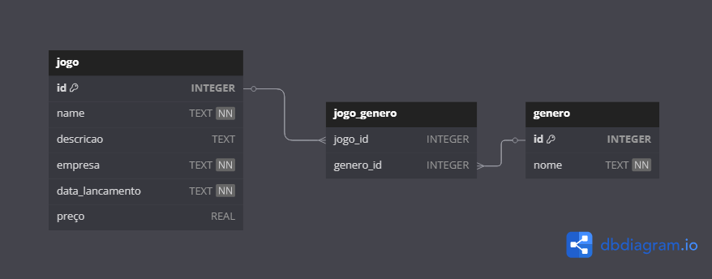

# Sistema de Gerenciamento de Jogos e Gêneros

## 📘 Descrição Geral

Esta aplicação é um sistema simples de gerenciamento de **jogos e gêneros**, desenvolvido em Python com a biblioteca **Peewee ORM** e arquitetura em camadas (Controller, Service, Repository, Model). Permite ao usuário cadastrar, listar, atualizar e remover jogos e gêneros através de menus interativos no terminal.

---

## JOGO (RECURSO PRINCIPAL)

▸ PROPRIEDADES E ESPECIFICAÇÕES

● NOME
  - Tipo: Texto (string)
  - Obrigatório: SIM
  - Uso: Nome oficial do jogo
  - Exemplo: The Witcher 3: Wild Hunt

● DESCRIÇÃO
  - Tipo: Texto (string) 
  - Obrigatório: NÃO
  - Uso: Resumo breve (até 255 caracteres)
  - Exemplo: RPG de mundo aberto com elementos de ação

● DATA_LANCAMENTO  
  - Formato: YYYY-MM-DD
  - Obrigatório: SIM
  - Exemplo: 2015-05-19

● GÊNEROS
  - Tipo: Lista (separada por vírgulas)
  - Obrigatório: NÃO
  - Exemplo: RPG, Ação, Mundo Aberto

● EMPRESA
  - Tipo: Texto (string)
  - Obrigatório: SIM
  - Exemplo: CD Projekt Red

● PREÇO
  - Tipo: Número decimal
  - Formato: R$ 0.00
  - Obrigatório: NÃO
  - Exemplo: 79.90



---

## 💻 Linguagem e Tecnologias Utilizadas

- **Linguagem:** Python 3.12
- **ORM:** Peewee
- **Banco de Dados:** SQLite (integrado)
- **Testes:** unittest
- **Containerização:** Docker
- **Gerenciador de dependências:** venv

---

## 📦 Instalação de Dependências

1. Clone o repositório:

   ```bash
   git clone https://github.com/RafaelFerreira18/dti-tech-challenge.git
   cd dti-tech-challenge
   ```

2. Crie e ative um ambiente virtual:

   ```bash
   python -m venv .venv
   source .venv/bin/activate  # Linux/Mac
   .venv\Scripts\activate   # Windows
   ```

3. Instale as dependências:

   ```bash
   pip install -r requirements.txt
   ```

---

## 🐳 Executando com Docker

1. Compile a imagem:

   ```bash
   docker build -t playbase .
   ```

2. Execute o container:

   ```bash
   docker run -it playbase
   ```

> Certifique-se de que os arquivos `Dockerfile`, `requirements.txt` e a pasta `app/` estão no mesmo diretório.

---

## ▶️ Executando a Aplicação Manualmente (Sem Docker)

```bash
python -m app.main
```

---

## 📚 Funcionalidades da Aplicação

### 🎮 Menu de Jogos

```text
1. Listar Jogos
2. Buscar Jogo por nome
3. Adicionar Jogo
4. Editar Jogo
5. Excluir Jogo
0. Voltar
```

**Exemplo de adição:**

- Nome: God of War
- Descrição: Ação e mitologia
- Data: 2022-10-20
- Gêneros: Ação, Aventura
- Empresa: Santa Monica Studio
- Preço: 199.90

### 🧩 Menu de Gêneros

```text
1. Listar Gêneros
2. Buscar ou criar Gênero
3. Editar Gênero
4. Excluir Gênero
0. Voltar
```

**Exemplo de criação:**

- Nome: RPG

---

## 🧪 Executando os Testes

Todos os testes estão na pasta `tests/`.

Execute:

```bash
python -m unittest discover tests
```

---

## 📂 Estrutura de Pastas

```
.
├── app/
│   ├── controllers/
│   ├── services/
│   ├── repositories/
│   ├── models/
│   └── main.py
├── tests/
    ├── generoTests/
    ├── jogoTests/
├── logs/
    ├── registro.log
├── Dockerfile
├── requirements.txt
└── README.md
```
